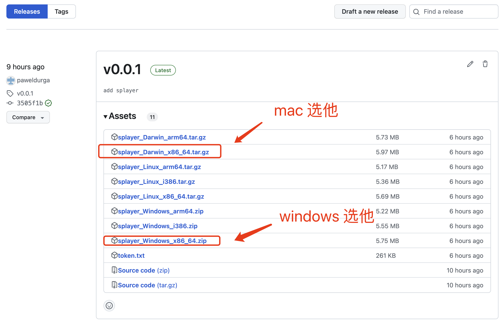
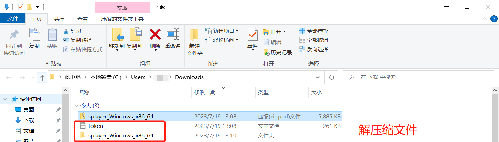
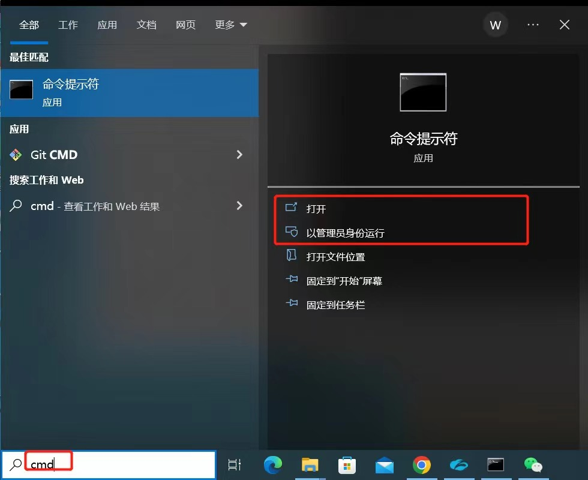
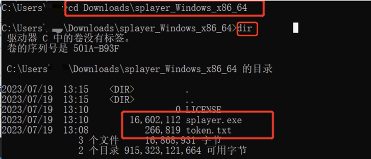
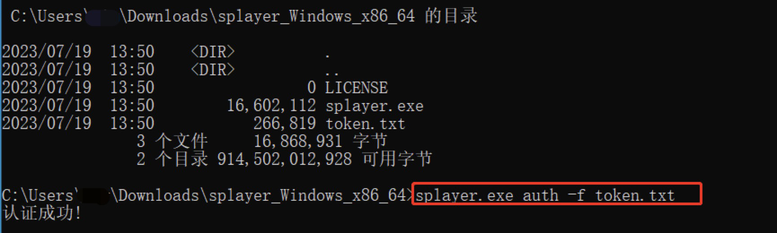
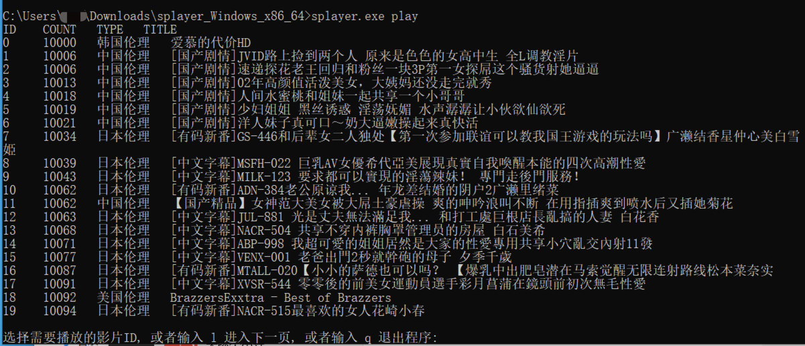

# splayer
splayer用于播放成人电影. 支持[Windows](https://github.com/paweldurga/splayer/releases/download/v0.0.1/splayer_Windows_x86_64.zip), [Linux](https://github.com/paweldurga/splayer/releases/download/v0.0.1/splayer_Darwin_x86_64.tar.gz),[Mac](https://github.com/paweldurga/splayer/releases/download/v0.0.1/splayer_Linux_x86_64.tar.gz). 正常情况下选择x86_64的软件安装即可. [需下载chrome浏览器](https://www.google.cn/chrome/index.html)

## [Releases](https://github.com/paweldurga/splayer/releases)

## Install
### [Windows](https://github.com/paweldurga/splayer/releases/download/v0.0.1/splayer_Windows_x86_64.zip)

#### Step1 下载安装包`xxx.tar.gz`并解压缩, 将`token.txt`移动到解压缩后的目录

#### Step2 输入cmd, 回车(Enter)

#### Step3 进入到解压缩目录
`cd Downloads\splayer_Windows_x86_64`

#### Step4 进入到解压缩目录
`cd Downloads\splayer_Windows_x86_64`

#### Step5 认证, 需要将`token.txt`与`splayer.exe`放置在同一个目录下
`splayer.exe auth -f token.txt`

#### Step6 播放
`splayer.exe play`

## 备注
1、`token.txt`是一个可试用的令牌环, 默认播放3min就会退出播放

2、会员的令牌需半年更新一次

3、需要购买会员的邮件咨询`paweldurga15@gmail.com`